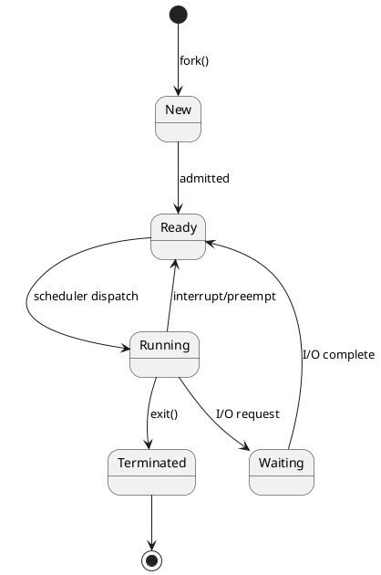
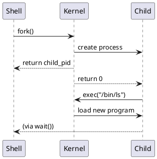
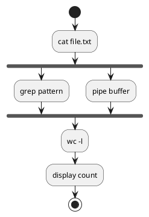

# Guide: PlantUML diagrams in the kit

PlantUML enables diagrams as text (Git-versionable) → PNG/SVG images for slides and worksheets.

## 1. Locations in the kit

- Diagrams per week: `SO_cursXX/diagrame/*.puml`
- Common styles: `diagrame_common/skin.puml`

## 2. Quick generation

```bash
# With the kit script (downloads JAR automatically)
python3 generate_diagrams.py --output ./_rendered

# Directly with local JAR
java -jar plantuml.jar -tpng diagrame/*.puml
```

## 3. Basic syntax (OS examples)

### 3.1 State diagram (processes)



### 3.2 Sequence diagram (fork/exec)



### 3.3 Activity diagram (pipeline)



## 4. Quick Reference

| Element | Syntax | OS Usage |
|---------|--------|----------|
| State | `State1 --> State2` | Process states |
| Note | `note right: text` | Explanations |
| Fork | `fork` / `end fork` | Parallel processes |
| If | `if (cond) then` | Flowchart decisions |
| Group | `box "Kernel"` | User/kernel separation |
| Colour | `#LightBlue` | Highlighting |

## 5. Including the common skin

At the beginning of each `.puml`:
```plantuml
@startuml
!include ../diagrame_common/skin.puml
' ... rest of the diagram
@enduml
```

## 6. Recommendations

- **Lecture**: overview diagrams (architecture, states)
- **Laboratory**: flow diagrams (steps, decisions)
- Source (`.puml`) in Git, images as derivative (regenerable)

## 7. Debugging diagrams

Common errors:
- `!include` with wrong path → check relative path
- Missing `@startuml`/`@enduml` → mandatory
- Special characters in labels → use `"text with spaces"`

Quick online testing: https://www.plantuml.com/plantuml/uml/

Edition date: **27 January 2026**
